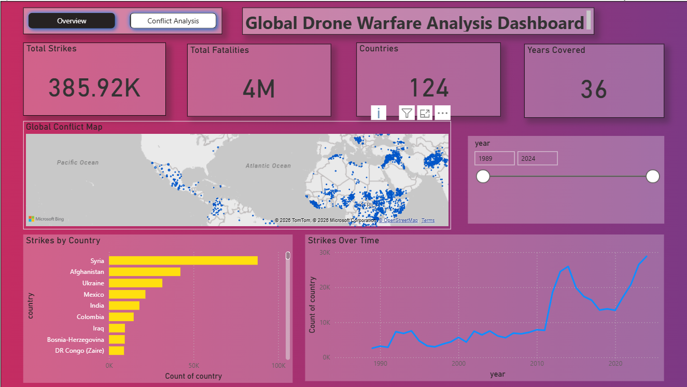

# Global Drone Warfare Analysis Dashboard

This project presents an interactive Power BI dashboard designed to analyze global drone warfare data.  
The dashboard transforms raw conflict data into clear and meaningful visual insights using Power BI.

The goal of this project is to help users understand patterns in drone strikes, fatalities, affected countries, and regional trends through interactive visualizations.

---

## Dashboard Features

• Total number of drone strikes  
• Total fatalities caused by drone strikes  
• Number of countries affected  
• Years covered in the dataset  
• Country-wise comparison of drone strikes  
• Trend analysis of strikes over time  
• Regional analysis of civilian deaths  
• Global map visualization of conflicts  
• Interactive filters and slicers for exploring different time periods

---

## Dashboard Preview

### Overview Dashboard

### Conflict Analysis Dashboard

---

## Project Files

• `Global Drone analysis dashboard.pbix` – Power BI dashboard file  
• `drone_warfare_dataset.csv` – Dataset used for the analysis  
• `dashboard_preview_1.png` – Overview dashboard screenshot  
• `dashboard_preview_2.png` – Conflict analysis dashboard screenshot  

---

## Tools Used

• Microsoft Power BI  
• Data Visualization Techniques  
• CSV Dataset Processing  

---

## Objective

The objective of this project is to build an interactive dashboard that allows users to explore and understand global drone warfare data through clear and structured visualizations.
